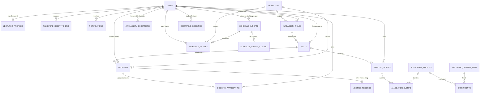
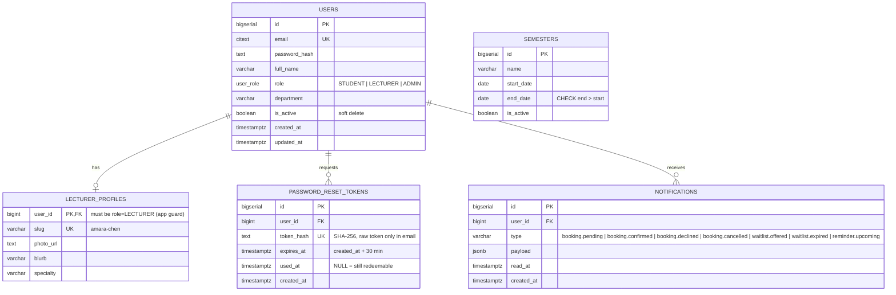
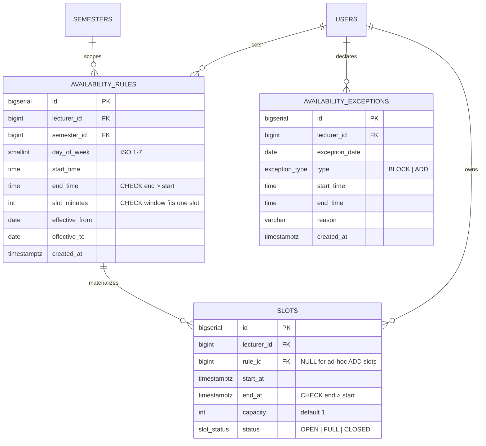
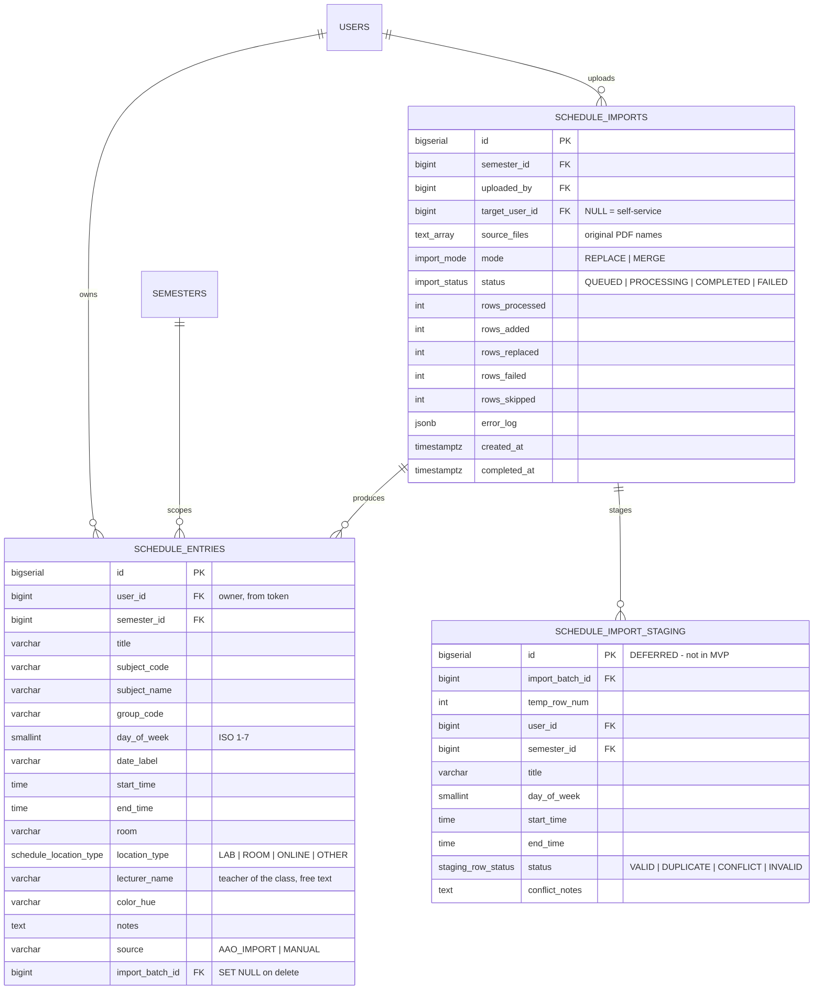
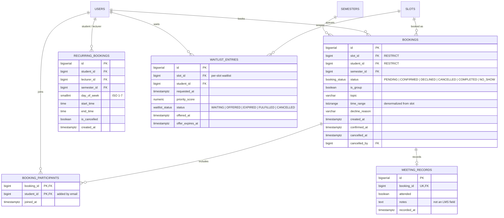
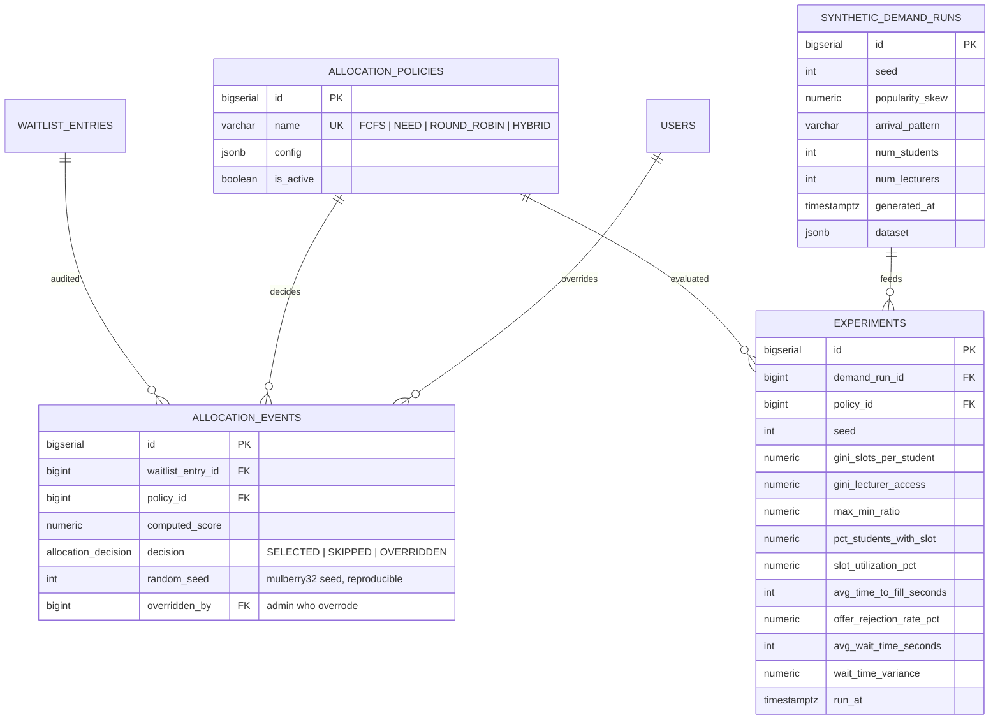

# OfficeHours — Database Schema Prototype (PostgreSQL)

Sơ đồ ERD dạng Mermaid, rút ra từ `capstone-db-schema.md` (nguồn chính xác, có đầy đủ DDL, index và constraint).
File này là bản nhìn nhanh để dev backend định hình entity và quan hệ trước khi viết migration.
Xem trên GitHub, VS Code (Markdown Preview Mermaid) hoặc dán vào <https://mermaid.live>.

Quy ước: `PK` khóa chính, `FK` khóa ngoại, `UK` unique. Kiểu `numeric`/`varchar` bỏ độ dài cho gọn.
`day_of_week` luôn là ISO 1–7 (Thứ 2 = 1 … Chủ nhật = 7).

---

## 1. Tổng quan (chỉ bảng + quan hệ)

---

## 2. Identity & Directory

---

## 3. Availability & Slots (lecturer)

> Slots được materialize từ rule (cộng/trừ exception) khi rule được tạo hoặc sửa. `rule_id ON DELETE SET NULL` để xóa rule không xóa lịch sử booking.

---

## 4. Timetable (busy blocks, import từ PDF)

> **Luồng import (MVP):** trình duyệt parse PDF → gửi một mảng JSON `rows[]` tới `POST /users/me/schedule-entries/batch` → backend validate, ghi `schedule_entries` trong **một transaction** + một dòng `schedule_imports` (`COMPLETED` hoặc `FAILED`).
> **Dedup MERGE:** `UNIQUE (user_id, semester_id, day_of_week, start_time, end_time, subject_code) NULLS NOT DISTINCT` (PostgreSQL 15+) để `INSERT … ON CONFLICT DO NOTHING` dùng được.

---

## 5. Booking, Waitlist, Recurring

**Ràng buộc quan trọng**

| Ràng buộc | Mục đích |
|---|---|
| `EXCLUDE USING gist (lecturer_id WITH =, time_range WITH &&) WHERE (status = 'CONFIRMED')` (cần `btree_gist`) | Không bao giờ double-book một giảng viên; chỉ áp dụng cho `CONFIRMED`, nên nhiều `PENDING` cùng slot là hợp lệ |
| `/confirm` bắt lỗi vi phạm exclusion → `409 SLOT_ALREADY_CONFIRMED` | Người xác nhận sau thua; cùng transaction tự `DECLINED` các `PENDING` còn lại của slot |
| `UNIQUE (slot_id, student_id)` trên `waitlist_entries` | Một sinh viên chỉ xếp hàng một lần cho mỗi slot |
| `position` waitlist **không có cột** | Tính khi đọc theo `requested_at` / `priority_score` giữa các `WAITING` của slot |
| Job định kỳ: `OFFERED` quá `offer_expires_at` → `EXPIRED` rồi chạy lại allocation | Offer hết hạn tự nhả slot |

---

## 6. Allocation Engine & Research

> `allocation_events` + `random_seed` giúp chạy lại một quyết định cho ra đúng kết quả cũ (audit và nghiên cứu công bằng). Các bảng `synthetic_demand_runs` / `experiments` là dữ liệu nghiên cứu, không thuộc luồng sản phẩm chính.

---

## 7. Enum

| Enum | Giá trị |
|---|---|
| `user_role` | STUDENT, LECTURER, ADMIN |
| `exception_type` | BLOCK, ADD |
| `schedule_location_type` | LAB, ROOM, ONLINE, OTHER |
| `import_mode` | REPLACE, MERGE |
| `import_status` | QUEUED, PROCESSING, COMPLETED, FAILED |
| `staging_row_status` | VALID, DUPLICATE, CONFLICT, INVALID |
| `slot_status` | OPEN, FULL, CLOSED |
| `booking_status` | PENDING, CONFIRMED, DECLINED, CANCELLED, COMPLETED, NO_SHOW |
| `waitlist_status` | WAITING, OFFERED, EXPIRED, FULFILLED, CANCELLED |
| `allocation_decision` | SELECTED, SKIPPED, OVERRIDDEN |

## 8. Extension cần bật

`citext` (email không phân biệt hoa thường), `btree_gist` (exclusion constraint chống double-booking). `NULLS NOT DISTINCT` yêu cầu PostgreSQL 15 trở lên.
