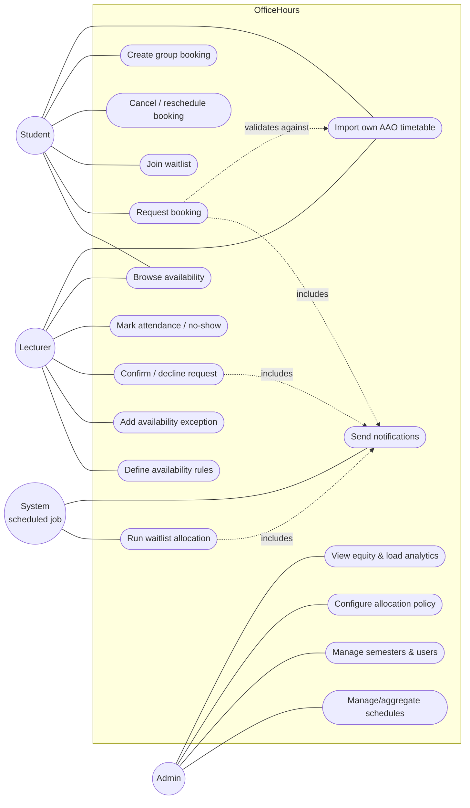
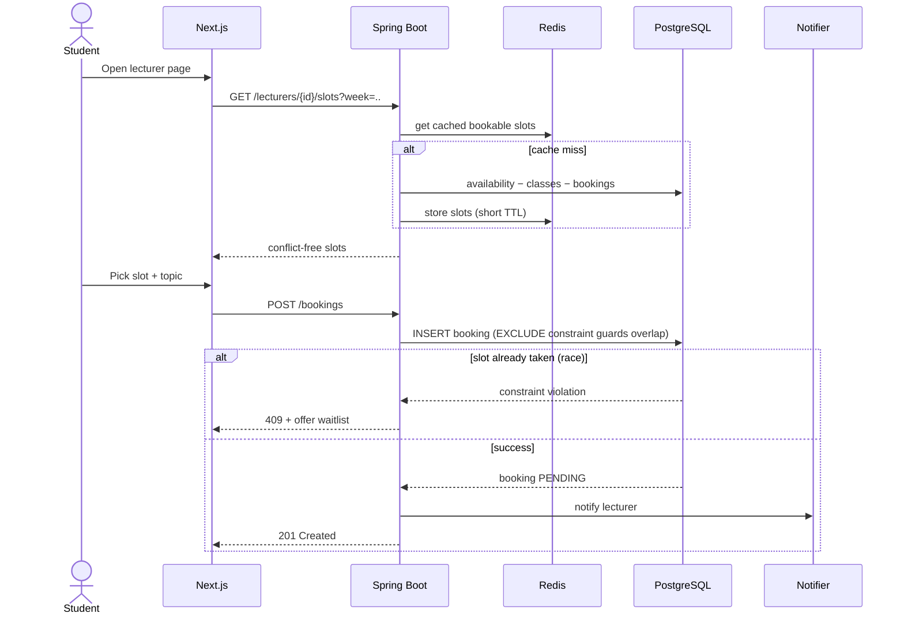
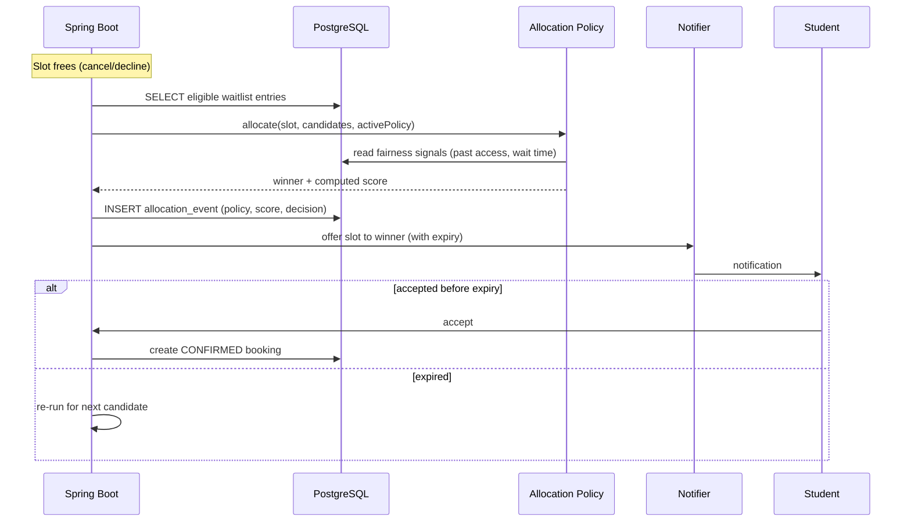
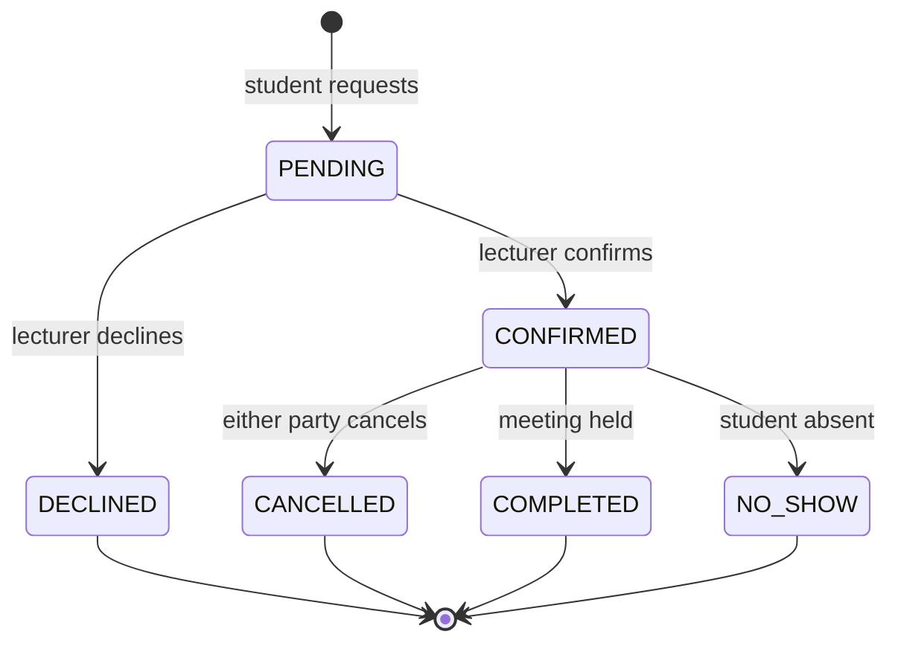
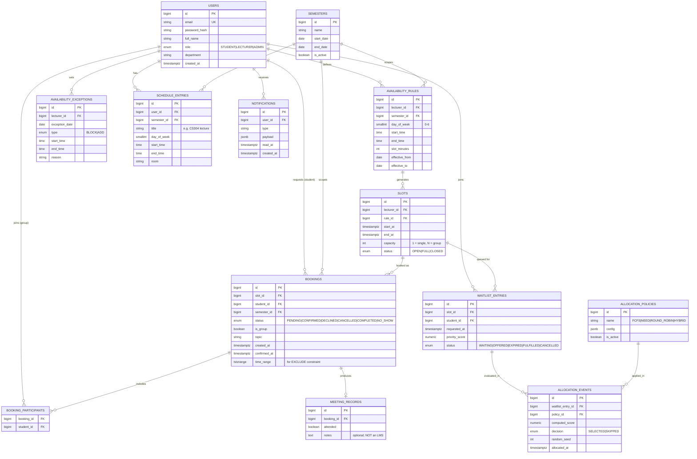
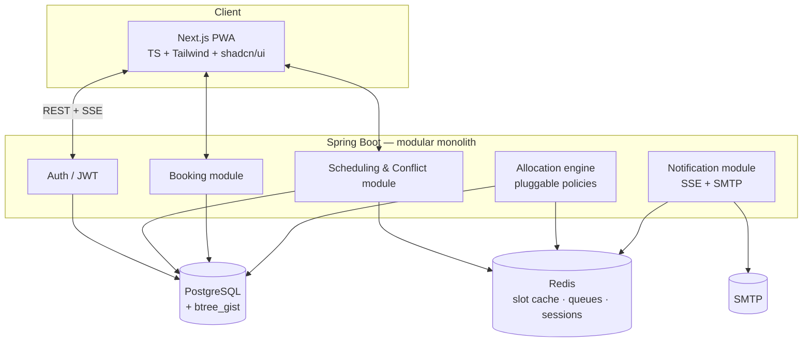
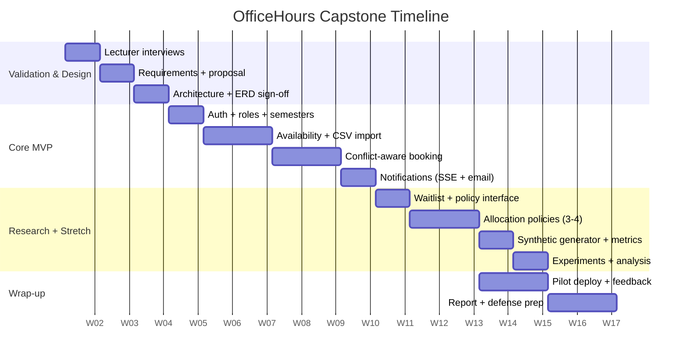

# OfficeHours — University Office-Hours Scheduling Platform
### Capstone Project Planning Document

| | |
|---|---|
| **Team size** | 4 |
| **Institution** | Eastern International University (EIU) |
| **Stack** | Spring Boot · Next.js (TS) · PostgreSQL · Redis · Docker |
| **Research thread** | Fairness in constrained slot allocation |
| **Document status** | Draft v0.1 — pre-validation (to be confirmed with lecturer interviews) |

---

## 1. Executive Summary

**OfficeHours** is a scheduling platform purpose-built for the university domain. Unlike generic tools (Calendly, Google Calendar appointment slots), it understands *class schedules, semesters, lecturer availability patterns, and student cohorts*, and it uses that domain knowledge to (a) prevent scheduling conflicts automatically and (b) allocate scarce office-hour slots **fairly** when demand exceeds supply.

The product ships as something EIU can actually deploy. The research contribution is a comparative study of **fair allocation policies** for oversubscribed slots — a real, literature-backed question in mechanism design and resource allocation, producing quantitative metrics (Gini coefficient of access, wait-time variance) suitable for a defense chapter and a graduate-school portfolio.

**One-line pitch:** *"A university-aware scheduling platform that prevents conflicts automatically and allocates limited office-hour slots fairly — validated with a comparative study of allocation policies."*

---

## 2. Problem Statement

Current office-hours coordination at most universities is manual and inefficient:

1. **Booking is chaotic.** Students email lecturers to request meetings; lecturers track availability in their heads or spreadsheets. Double-bookings and missed requests are common.
2. **Schedule conflicts are invisible.** Students book slots that clash with their own classes; lecturers offer slots that clash with their teaching. Nobody validates this ahead of time.
3. **Allocation is unfair.** Popular lecturers get oversubscribed. Fast-responding or well-connected students capture most slots; others are shut out. There is no principled way to share scarce advisor time.
4. **No accountability.** There is no record of who met whom, when, or why — making advisor-load analysis and no-show tracking impossible.

> **Validation note:** Problems 1–4 are *hypotheses* until confirmed. The lecturer interview guide (Section 15) exists to validate them. If lecturers don't feel this pain, the project should be reconsidered.

---

## 3. Goals & Objectives

### 3.1 Product goals
- **G1** — Let lecturers publish availability once and have it respected automatically.
- **G2** — Prevent conflicts between bookings, class schedules, and existing commitments *before* a booking is confirmed.
- **G3** — Provide a fair, transparent mechanism for allocating oversubscribed slots.
- **G4** — Give administrators visibility into advisor load, no-show rates, and access equity.

### 3.2 Research objective (the capstone core)
- **R1** — Design, implement, and empirically compare multiple slot-allocation policies (FCFS, priority-by-need, round-robin, and a hybrid), measuring **fairness** and **efficiency** trade-offs under realistic and synthetic demand.

### 3.3 Success criteria
- Functional MVP deployed and used by ≥ 3 pilot lecturers for ≥ 4 weeks.
- Allocation subsystem supports at least 3 pluggable policies, switchable via configuration.
- A reproducible experiment (real + synthetic data) producing fairness/efficiency metrics with statistical comparison across policies.
- Defense-ready write-up of methodology, results, and trade-offs.

---

## 4. Target Users & Personas

| Persona | Role | Goals | Pain today |
|---|---|---|---|
| **Minh** | Student | Book advisor time that doesn't clash with classes; get a fair shot at popular lecturers; import his own class timetable so booking never clashes with class | Emails go unanswered; slots taken before he sees them |
| **Dr. Lan** | Lecturer / Advisor | Publish availability once; avoid double-bookings; not get swamped; import her own teaching timetable | Manual tracking; no-shows; overwhelmed by requests |
| **Team Alpha** | Capstone team (group) | Book a recurring weekly slot with their advisor as a group | Coordinating 4 calendars + advisor by email is painful |
| **Ms. Huong** | Department admin | Monitor and aggregate imported schedules; balance advisor load; monitor equity and no-shows | No data at all today |

---

## 5. Scope

### 5.1 In Scope (MVP — must ship)

- **Accounts & roles:** Student, Lecturer, Admin. JWT auth.
- **Semester management:** Admin defines active semester with date bounds.
- **Availability management:** Lecturer defines recurring weekly availability + one-off exceptions (block a date, add an extra slot).
- **Schedule import (self-service):** Students and lecturers each upload their **own** official AAO (Academic Affairs Office) timetable export → parsed into "busy" blocks used for conflict detection. Because the file must be a genuine AAO export (the school's system of record), not free-form self-reported data, any user may upload their own without a data-integrity risk. Admin retains an aggregation/oversight + manual-entry fallback role, not exclusive upload rights.
- **Conflict-aware booking:** Student requests a slot; system rejects any slot clashing with the student's classes, the lecturer's teaching, or an existing booking. Enforced at the database level via exclusion constraints.
- **Booking lifecycle:** request → confirm/decline → complete / cancel / mark no-show.
- **Notifications:** Email (SMTP) + in-app (SSE) for booking events.
- **Rescheduling & cancellation** with notice-period rules.
- **Dashboards:** student (upcoming/past), lecturer (queue + calendar), admin (basic reports).

### 5.2 In Scope (Stretch — pick 2–3, tied to research)

- **Waitlist + fairness allocation** *(this is the research vehicle — strongly recommended as the primary stretch item).*
- **Group bookings** (capstone team → one advisor slot).
- **Recurring bookings** (weekly advisor meeting for a semester).
- **Admin analytics:** advisor load balancing, no-show rates, access-equity (Gini) dashboard.
- **Public "office hours this week"** read-only view.

### 5.3 Out of Scope (explicitly excluded — defend this on the wall)

- ❌ Full LMS features (assignments, grading, course content, quizzes).
- ❌ Built-in video conferencing — link to Zoom/Meet, don't build it.
- ❌ Payments / tutoring marketplace (this is not Calendly-for-tutors).
- ❌ Physical room-booking / resource scheduling (different problem).
- ❌ Native mobile apps — responsive PWA only.
- ❌ Deep SIS integration — CSV import is sufficient for the capstone; live SIS sync is future work.
- ❌ Multi-university tenancy — single-institution deployment only.

> **Scope-creep guard:** The most likely creep is toward LMS features ("add meeting notes" → "add tasks" → "add grades"). Meeting notes are acceptable *only* as an optional text field on a completed booking; anything beyond that is out of scope.

---

## 6. Use Case Diagram

> Mermaid has no native UML use-case notation; the graph below is the conventional workaround (actors on the outside, use cases as rounded nodes). It renders on GitHub, VS Code (Mermaid plugin), and most Markdown viewers.

### 6.1 Key Use Case Descriptions

**UC2 — Request booking**
- *Actor:* Student
- *Precondition:* Authenticated; active semester; lecturer has published availability.
- *Main flow:* Student selects a lecturer → sees only slots that are free **and** conflict-free for that student → picks one → enters topic → submits.
- *Validation:* System rejects the request if the slot clashes with (a) student's classes, (b) lecturer's teaching, (c) an existing confirmed booking.
- *Postcondition:* Booking created in `PENDING`; lecturer notified.
- *Alternate:* If the slot is full/oversubscribed → offer **UC3 Join waitlist**.

**UC8 — Confirm / decline request**
- *Actor:* Lecturer
- *Main flow:* Lecturer reviews pending request → confirms or declines with optional reason.
- *Postcondition:* Booking → `CONFIRMED` or `DECLINED`; student notified. On decline, the freed slot may trigger **UC14**.

**UC14 — Run waitlist allocation** *(research core)*
- *Actor:* System (triggered when a confirmed slot is cancelled/declined, or on a schedule)
- *Main flow:* For the freed slot, gather all eligible waitlist entries → apply the **active allocation policy** → select a winner → offer the slot with an expiry → log the decision (`allocation_events`) for reproducibility.
- *Postcondition:* Offer sent; on acceptance → booking; on expiry → re-run for next candidate.

---

## 7. Functional Requirements

| ID | Requirement | Priority |
|---|---|---|
| FR-1 | Users register/login; role assigned (Student/Lecturer/Admin) | Must |
| FR-2 | Admin creates and activates a semester with date bounds | Must |
| FR-3 | Lecturer defines recurring weekly availability rules | Must |
| FR-4 | Lecturer adds one-off exceptions (block/add) | Must |
| FR-5 | Students/lecturers import their **own** official AAO timetable export → busy blocks; parser rejects non-AAO files | Must |
| FR-5a | Admin can manually add/edit/delete any user's busy blocks (support fallback) and view aggregated schedule data across users | Must |
| FR-6 | System computes bookable slots = availability − conflicts | Must |
| FR-7 | Student requests a booking; DB enforces no double-booking | Must |
| FR-8 | Lecturer confirms/declines; both parties notified | Must |
| FR-9 | Cancel/reschedule with configurable notice period | Must |
| FR-10 | Attendance / no-show marking on completed bookings | Must |
| FR-11 | Email + in-app (SSE) notifications for lifecycle events | Must |
| FR-12 | Waitlist: student joins queue for an oversubscribed slot | Should |
| FR-13 | Pluggable allocation policy applied on slot free-up | Should |
| FR-14 | Every allocation decision logged for reproducibility | Should |
| FR-15 | Group bookings (multiple students, one slot) | Could |
| FR-16 | Recurring bookings for a semester | Could |
| FR-17 | Admin analytics: load, no-show rate, access-equity (Gini) | Could |
| FR-18 | Public read-only "office hours this week" view | Could |

---

## 8. Non-Functional Requirements

- **NFR-1 Performance:** Bookable-slot query for a lecturer/week returns in < 300 ms at pilot scale; benchmarked up to 10k lecturers / 100k students (synthetic) for the research chapter.
- **NFR-2 Correctness:** Double-booking must be impossible even under concurrent requests — enforced at the DB layer (exclusion constraint), not only in application code.
- **NFR-3 Reproducibility:** Allocation decisions are deterministic given inputs + policy + seed, and fully logged.
- **NFR-4 Security:** JWT auth; role-based authorization on every endpoint; passwords hashed (bcrypt/argon2); CSV import validated (MIME + schema).
- **NFR-5 Usability:** Mobile-first PWA; a student can book in ≤ 3 taps from the lecturer's page.
- **NFR-6 Observability:** Structured logs; basic metrics (booking counts, allocation runs, notification delivery).
- **NFR-7 Deployability:** `docker compose up` brings up the full stack for dev; single-VM deploy for the pilot.

---

## 9. Core Workflows

### 9.1 Booking with conflict detection

### 9.2 Waitlist allocation (the research path)

### 9.3 Booking state machine

---

## 10. Entity-Relationship Diagram

### 10.1 Design notes

- **Double-booking prevention.** On `BOOKINGS`, use a PostgreSQL exclusion constraint over `(lecturer_id WITH =, time_range WITH &&)` for confirmed bookings (`EXCLUDE USING gist`). This makes overlapping confirmed bookings *impossible* at the storage layer, even under concurrency — a clean point to raise in your defense.
- **SLOTS: materialized vs computed.** Two options: (a) generate concrete `SLOTS` rows from rules (simpler to reason about, easier to attach waitlists and allocation events — **recommended**), or (b) compute slots on the fly (less storage, harder to reference). The ERD assumes (a) because the research needs concrete, referenceable slot objects.
- **SCHEDULE_ENTRIES is generic.** Both student classes and lecturer teaching are stored here as busy blocks. This keeps conflict detection uniform — the query is "does any schedule_entry for this user overlap this slot?" Since the table is per-`user_id` and populated from that user's own authoritative AAO export, self-service upload by students and lecturers requires no schema change — the same generic busy-block row is produced regardless of who uploaded it.
- **ALLOCATION_EVENTS is the reproducibility backbone.** Every decision records the policy, the computed score, and the random seed → experiments are replayable, which is exactly what a committee wants to see.

---

## 11. Research Design — Fairness in Slot Allocation

This is the heart of the capstone. Treat it as a first-class deliverable, not a feature.

### 11.1 The question
> When office-hour slots are scarcer than demand, **which allocation policy best balances fairness and efficiency**, and what are the trade-offs?

### 11.2 Policies to implement & compare
1. **FCFS (baseline)** — first come, first served. Simple, but rewards speed/luck, not need.
2. **Priority-by-need** — score by how long since the student last met *this* lecturer (or any lecturer), plus wait time. Favors the underserved.
3. **Round-robin across students** — cap per-student access per window so no one monopolizes popular lecturers.
4. **Hybrid** — weighted combination (need + wait time + a small randomization term for tie-breaking / anti-gaming).

All four implement one interface: `allocate(slot, candidates, config) → winner + score`. Switchable via `ALLOCATION_POLICIES.is_active`.

### 11.3 Metrics
- **Fairness:** Gini coefficient of *slots-per-student* and of *lecturer-access-per-student*; max–min ratio; % of students who got ≥ 1 slot.
- **Efficiency:** slot utilization (% of offered slots filled), average time-to-fill a freed slot, offer-rejection/expiry rate.
- **Responsiveness:** average wait time in queue; variance of wait time.

### 11.4 Experimental method
- **Real data:** the pilot deployment's actual bookings/waitlists (small but genuine).
- **Synthetic data:** a demand generator (configurable popularity skew, arrival patterns, class-schedule constraints) to stress each policy at scale and under controlled conditions.
- **Procedure:** replay the *same* demand stream through each policy (fixed seed) → compute metrics → compare with appropriate statistics (e.g., repeated runs + confidence intervals). Because everything is logged and seeded, results are reproducible.
- **Deliverable:** a results section with plots (fairness vs efficiency frontier per policy) + a discussion of trade-offs. This is your defense centerpiece and grad-school writing sample.

### 11.5 Why this is defensible
Resource allocation and fairness are established research areas (mechanism design, matching markets). You are not inventing an unsolved problem; you're doing a rigorous *applied* comparison in a real setting — the sweet spot for an undergraduate capstone aimed at a graduate application.

---

## 12. System Architecture

**Deliberate simplicity:** modular monolith (not microservices), SSE (not WebSockets), no Kafka, no CRDTs. This matches your team's stated comfort zone and keeps effort focused on the two things that matter — correct conflict handling and the fairness study.

---

## 13. Tech Stack

| Layer | Choice | Notes |
|---|---|---|
| Frontend | Next.js (App Router), TypeScript, Tailwind, shadcn/ui | Mobile-first PWA |
| Backend | Spring Boot (Java), modular monolith | Your core strength |
| Database | PostgreSQL + `btree_gist` | Exclusion constraints for no double-booking |
| Cache/Queue | Redis | Slot cache, waitlist queues, sessions |
| Auth | JWT | Role-based (Student/Lecturer/Admin) |
| Real-time | Server-Sent Events | Bounded; notifications only |
| Email | SMTP (e.g., JavaMail) | Lifecycle notifications |
| Infra | Docker + Docker Compose | Dev parity + single-VM pilot deploy |
| Research | Synthetic demand generator (Java/Python) + notebook for metrics/plots | Reproducible experiments |

---

## 14. Timeline (indicative 14-week semester)

> Adjust dates to your real academic calendar. The key ordering: **validate → core booking → research** — don't start policies before conflict-aware booking works, since the research depends on real bookings/waitlists.

---

## 15. Team Responsibility Matrix (4 people)

| Member | Primary | Secondary |
|---|---|---|
| **Dev 1 (Backend lead)** | Spring Boot core, DB schema, exclusion constraints, conflict engine | Deployment/Docker |
| **Dev 2 (Backend / research)** | Allocation engine, policies, synthetic generator, experiments | Redis, queues |
| **Dev 3 (Frontend lead)** | Next.js app, booking UX, PWA | Notifications UI (SSE) |
| **Dev 4 (Frontend / analytics)** | Admin dashboards, equity/analytics views, plots | Docs, defense deck |

**One person owns the research thread end-to-end** (suggested: Dev 2) so the fairness study doesn't become an orphaned afterthought.

---

## 16. Risks & Mitigations

| # | Risk | Impact | Mitigation |
|---|---|---|---|
| 1 | Lecturers don't actually want this | Project has no users | **Interview first** (Section 17); get a pilot commitment before building |
| 2 | Perceived as "just a booking form" | Weak defense | Make the fairness study central; demo the research, not the form |
| 3 | Scope creep toward LMS | Missed deadline | Out-of-scope list on the wall; meeting-notes field is the hard ceiling |
| 4 | Not enough real waitlist data for research | Thin results | Synthetic demand generator as primary evidence; real data as validation |
| 5 | Conflict logic bugs (overlaps slip through) | Correctness failure | DB-level exclusion constraint + concurrency tests |
| 6 | Boring demo | Underwhelms committee | Live policy-comparison simulation on the equity dashboard |

---

## 17. Lecturer Interview Guide (do this THIS week)

Interview 5–10 lecturers. Goal: validate the pain and recruit ≥ 1 pilot user. Keep it to ~15 minutes.

**Warm-up**
1. How do students currently arrange to meet you outside class?
2. Roughly how many such meetings per week, and does it fluctuate (e.g., before deadlines)?

**Pain probing (don't lead the witness)**
3. What's annoying about the current process, if anything?
4. Have you had double-bookings, no-shows, or missed requests? How often?
5. When more students want time than you have, how do you decide who gets it today?
6. Do you feel some students get more of your time than others? Does that bother you?

**Solution reaction**
7. If a tool auto-blocked slots that clash with your teaching and students' classes, would that help — or is that not your problem?
8. Would you want a fair way to allocate limited slots, or do you prefer deciding manually?
9. What would make you *not* use a tool like this?

**Commitment**
10. Would you be willing to pilot it for a few weeks next semester and give feedback?

> **Kill criterion:** If most lecturers shrug at Q3–Q6 and none commit at Q10, the domain pain isn't real enough — revisit the API Gateway or another option rather than building something nobody wants.

---

## 18. Immediate Next Steps

1. **This week** — Run the interviews (Section 17). Log answers verbatim.
2. **If validated** — Write the 2-page proposal (problem, solution, MVP scope, research question, timeline) and take it to your advisor.
3. **Confirm** — Team agreement on the responsibility matrix and the fairness study as the research core.
4. **Then** — Freeze scope, set up the repo + Docker Compose skeleton, and start on auth + schema.

---

*Draft v0.1 — validate assumptions before committing. The single biggest risk is building something lecturers don't want; the interview guide exists to retire that risk first.*
